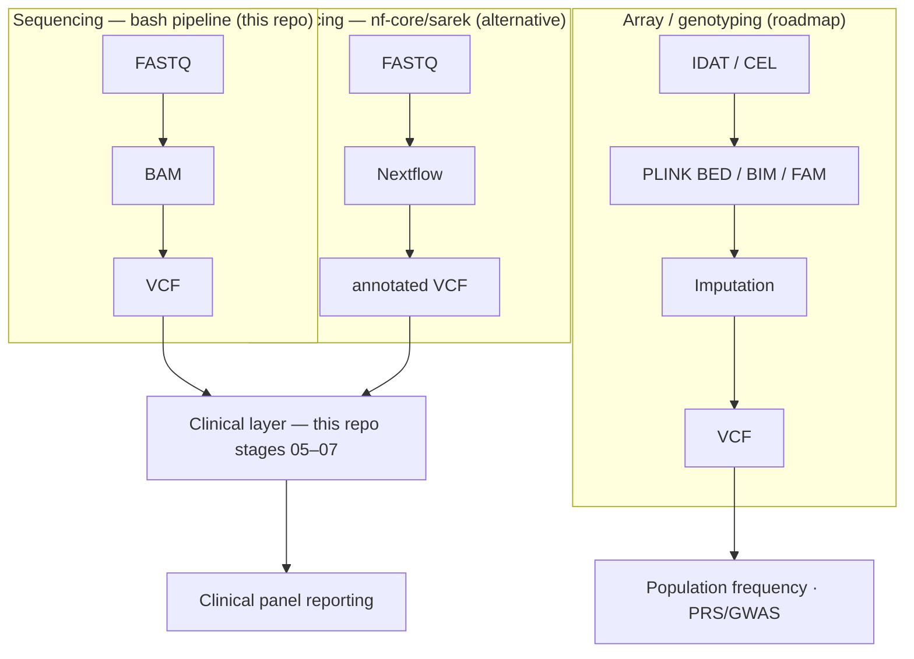

# Genomic data types and workflows: an introduction

This document is a vendor/tool-neutral introduction to the kinds of genomic data this pipeline
family deals with, the tools commonly used on each kind, and how tool choice depends on the goal
of the analysis — not just the input format. It's written for engineers/IT staff who need to
understand the data landscape well enough to build, operate, and extend genomics infrastructure,
without needing a wet-lab or clinical-genetics background.

The pipeline shipped in this repo (see [`pipeline/`](../pipeline/) and
[`test_case/`](../test_case/)) implements one concrete, runnable path through this landscape —
sequencing data, germline small-variant calling, gene-panel clinical reporting — using a
cardiomyopathy gene panel as its example. Everything else in this document describes the wider
landscape that a production platform in this space eventually needs to cover; sections marked
**(roadmap)** are not implemented as runnable code here.

## 1. Two data universes

Genomic data reaching a lab/analysis pipeline almost always starts as one of two fundamentally
different measurement types:

| | Sequencing | Array / genotyping |
|---|---|---|
| What's measured | The actual base sequence, read out in short fragments | Genotype at a fixed, pre-selected set of known positions |
| Raw output | Millions of overlapping short "reads" | A per-position intensity/genotype call for a fixed marker set (e.g. ~650K–2.5M SNPs) |
| Can find novel/rare variants? | Yes | No — only genotypes markers already on the chip |
| Relative cost/throughput | Higher cost per sample, scales with genome coverage needed | Much cheaper and faster per sample; standard for large cohorts |
| Typical file formats | FASTQ -> BAM/CRAM -> VCF | IDAT (Illumina) / CEL (Affymetrix) -> PLINK BED/BIM/FAM -> (optionally imputed) VCF |

Both universes converge on **VCF** once you have genotype/variant calls — everything downstream
of that point (annotation, clinical classification, population-frequency lookups, reporting) can,
in principle, be format-agnostic.

## 2. Sequencing-side formats, in order of the pipeline

1. **FASTQ** — raw sequencer output. Plain text (usually gzipped): four lines per read (id,
   sequence, `+`, per-base quality scores). No alignment information yet — just "here are the
   fragments we read."
2. **BAM / CRAM** — FASTQ reads aligned ("mapped") to a reference genome, sorted and indexed.
   CRAM is a more compressed variant of BAM (reference-based compression); functionally
   equivalent for most tools. This is the stage where duplicate reads get marked, and where
   quality-control metrics (coverage depth, contamination, etc.) are computed.
3. **VCF / gVCF** — the actual list of positions where a sample differs from the reference
   (or, for gVCF, a per-position summary that supports later joint genotyping across samples).
   This is the handoff point to annotation and reporting.
4. **BED** — not sequencing data itself, but a coordinate-range format used everywhere in this
   pipeline to define *which regions matter* — e.g. "the exons +/- 1kb of these 26 genes." Same
   BED-file mechanism works whether the goal is a disease panel, an exome capture design, or a
   set of GWAS-significant loci.
5. **TSV/CSV** — sample manifests, phenotype/clinical metadata, frequency tables — the
   "spreadsheet glue" that ties sample IDs to everything else.

## 2a. Reference genome builds (not locked to GRCh38)

The pipeline is **not** tied to hg38/GRCh38. Point `REF_FASTA` at any suitable assembly FASTA
(GRCh37/hg19, GRCh38/hg38, T2T-CHM13 v2, etc.) and align/call against it. What *is*
build-specific and must stay consistent:

| Setting | Must match `REF_FASTA` build |
|---|---|
| `CLINVAR_VCF` | ClinVar release for that build (NCBI FTP: `vcf_GRCh37`, `vcf_GRCh38`, …) |
| `PANEL_BED` / panel coordinates | Liftover or re-annotation if you change builds |
| `SNPEFF_DB` / VEP cache | Database for that assembly |
| `BCFTOOLS_PLOIDY` | bcftools preset (`GRCh37`, `GRCh38`, … — run `bcftools call --ploidy ?`) |

The **shipped demo** (`test_case/`) intentionally uses a GRCh38 slice because that matches the
original case study — it is an example, not a platform limitation. T2T and other non-GRCh
assemblies may need extra tool support (e.g. snpEff/VEP availability, contig naming) beyond
what the demo exercises.

## 3. Array/genotyping-side formats (roadmap — not implemented in this repo yet)

1. **IDAT (Illumina)** / **CEL (Affymetrix)** — raw, vendor-specific binary output of a
   genotyping microarray scanner. Requires vendor software (e.g. Illumina GenomeStudio) or an
   equivalent tool to turn scanner intensities into actual genotype calls.
2. **PLINK BED/BIM/FAM** — the near-universal exchange format for called genotypes in
   population/statistical genetics. (Note: this "BED" is *not* the same file format as the
   coordinate-range BED above — same three-letter extension, unrelated format, a common source
   of confusion.) `.bed` = genotype matrix, `.bim` = marker/SNP metadata, `.fam` = sample/
   pedigree metadata.
3. **Imputation** — arrays only genotype a few hundred thousand to ~2.5M fixed positions;
   imputation statistically fills in the many more positions not directly genotyped, using a
   reference haplotype panel. Two deployment modes matter operationally:
   - **Local imputation** (e.g. BEAGLE) — runs entirely on infrastructure you control; data never
     leaves the network. Preferred default when data residency/privacy rules apply.
   - **External imputation servers** (e.g. Michigan Imputation Server, TOPMed) — faster access to
     very large, frequently-updated reference panels, but the data is sent to a third party. Only
     appropriate with explicit, informed consent for that specific use.
4. Once imputed (or even without imputation, for directly-genotyped positions), results can be
   exported to **VCF**, joining the same downstream path as sequencing data.

## 4. Tool landscape: what's used where, and why

| Tool | Data it operates on | What it does | License / hardware |
|---|---|---|---|
| **DRAGEN** (Illumina) | FASTQ (sequencing) | FPGA-accelerated aligner + variant caller + annotator, one integrated appliance | Proprietary, requires licensed hardware/subscription |
| **bwa / bwa-mem2** | FASTQ (sequencing) | Open-source short-read aligner -> BAM | Open source, CPU |
| **samtools** | BAM/CRAM | Sort, index, mark duplicates, compute QC stats on aligned reads | Open source, CPU |
| **bcftools** | BAM/CRAM -> VCF | Pileup-based variant calling; also general-purpose VCF manipulation (filter, annotate, merge) | Open source, CPU |
| **GATK4 (HaplotypeCaller)** | BAM/CRAM -> VCF | Local-reassembly variant calling; different algorithmic approach from pileup callers, often used as a cross-check | Open source, CPU (Java) |
| **DeepVariant** | BAM/CRAM -> VCF | Deep-learning-based variant caller; another independent method for cross-validating calls **(roadmap: not wired into this repo yet)** | Open source, CPU/GPU |
| **snpEff / Ensembl VEP** | VCF | Gene/transcript/consequence annotation (which gene, which exon, missense vs synonymous, etc.) | Open source, CPU |
| **ClinVar / gnomAD / OMIM etc.** | VCF (as annotation sources) | Public knowledge bases: known pathogenicity, population allele frequencies, disease-gene associations | Public data, various licenses |
| **PLINK / PLINK2** | PLINK BED/BIM/FAM (array/genotype data) | QC, format conversion, association testing, PRS scoring — the standard toolkit for genotype-array and population-genetics work | Open source, CPU |
| **BEAGLE** | PLINK-format genotypes | Statistical imputation and phasing | Open source, CPU |

The key point for infrastructure planning: **DRAGEN and PLINK are not substitutes for each other**
— DRAGEN (and its open-source replacements: bwa/GATK/bcftools) operate on *sequencing* data;
PLINK operates on *already-called genotypes*, most commonly from arrays. Choosing "DRAGEN vs.
samtools" is a decision about *how* to process sequencing data; choosing "PLINK" is a decision
about *whether you're even in the array/genotype world at all*. This repo's pipeline only makes
the first kind of decision (see §5); it does not yet include the second.

## 5. Goal / tier matrix

The right tool chain depends on what question is being answered, not just what file format
arrived. Some representative tiers:

| Goal / tier | Typical input | Typical tool chain | Typical consumer |
|---|---|---|---|
| Clinical gene panel (e.g. a cardiomyopathy or carrier-screening panel) | FASTQ (targeted or WGS) | Aligner (bwa/DRAGEN) -> samtools -> variant caller (bcftools/GATK4) -> annotator (snpEff/VEP) + ClinVar -> panel filter -> report | Clinician / genetic counselor |
| Population frequency / "variant atlas" for a region or cohort **(roadmap)** | IDAT/CEL (array) | Genotyping software -> PLINK QC -> imputation -> VCF -> frequency aggregation | Population geneticist / public-health researcher |
| Unrestricted whole-genome analysis | FASTQ/CRAM | Same chain as clinical panel, but without a region-of-interest restriction — needs streaming/indexed processing rather than in-memory VCF handling at scale | Research / discovery |
| Polygenic risk scoring, GWAS **(roadmap)** | PLINK BED/BIM/FAM (often already QC'd) | PLINK association/PRS tooling, imputation | Population geneticist |
| Pharmacogenomics | VCF (subset of any of the above) | Targeted lookup against CPIC/PharmGKB annotations | Clinician / pharmacist |

This repo's pipeline currently implements the **clinical gene panel** row end-to-end (see
[`test_case/`](../test_case/) for a runnable, fully synthetic demo), and is architected so the
*panel definition itself* (gene list + BED region file, see [`panels/`](../panels/)) is a
swappable config, not hardcoded logic — the same pipeline can serve a different clinical panel
just by pointing it at a different panel config.

## 6. What's implemented here vs. roadmap

**Implemented and runnable today:**
- FASTQ -> BAM/CRAM -> VCF sequencing path (bwa + samtools + bcftools/GATK4) — **bash pipeline** in `pipeline/`.
- Two independent variant callers (bcftools primary, GATK4 secondary) as a cross-check pattern.
- ClinVar-based pathogenic-variant filtering and panel-scoped clinical HTML reporting.
- Swappable panel config (gene list + BED) — see [`panels/README.md`](../panels/README.md).
- A small, fully synthetic, shareable 2-sample demo (no real patient data) — see
  [`test_case/README.md`](../test_case/README.md).

**Alternative sequencing engine (documented, run externally):**
- [nf-core/sarek](https://nf-co.re/sarek/3.9.0/) — Nextflow pipeline for production-scale
  FASTQ→annotated VCF. Clinical stages 05–07 in this repo work on sarek output VCFs.
  See [`docs/SAREK_ALTERNATIVE.md`](docs/SAREK_ALTERNATIVE.md) and the pathway selector on the
  [interactive guide](https://toki-bio.github.io/example_workflow/).

**Roadmap (documented here, not yet built):**
- Array/genotyping ingestion path: IDAT/CEL -> genotype calling -> PLINK QC -> imputation -> VCF.
- Pluggable alternate callers beyond bcftools/GATK4 (e.g. DeepVariant) selectable via
  configuration rather than code changes.
- Workflow-manager orchestration (e.g. Nextflow or Snakemake) in place of the current plain-bash
  orchestration, for better parallelism, retries, and provenance tracking at scale.
- Structured, queryable run provenance (tool versions, parameters, input checksums) beyond the
  current stderr logging.
